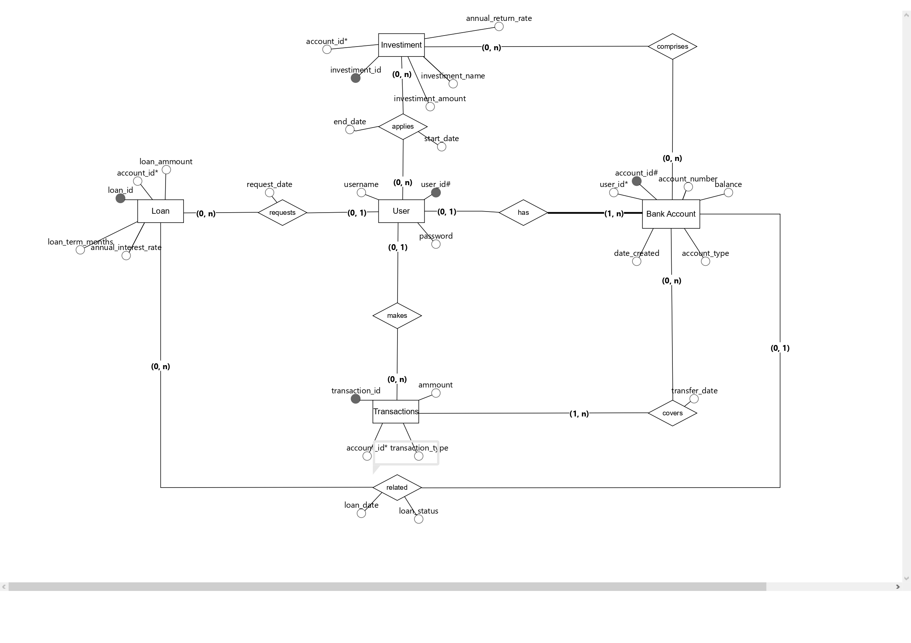
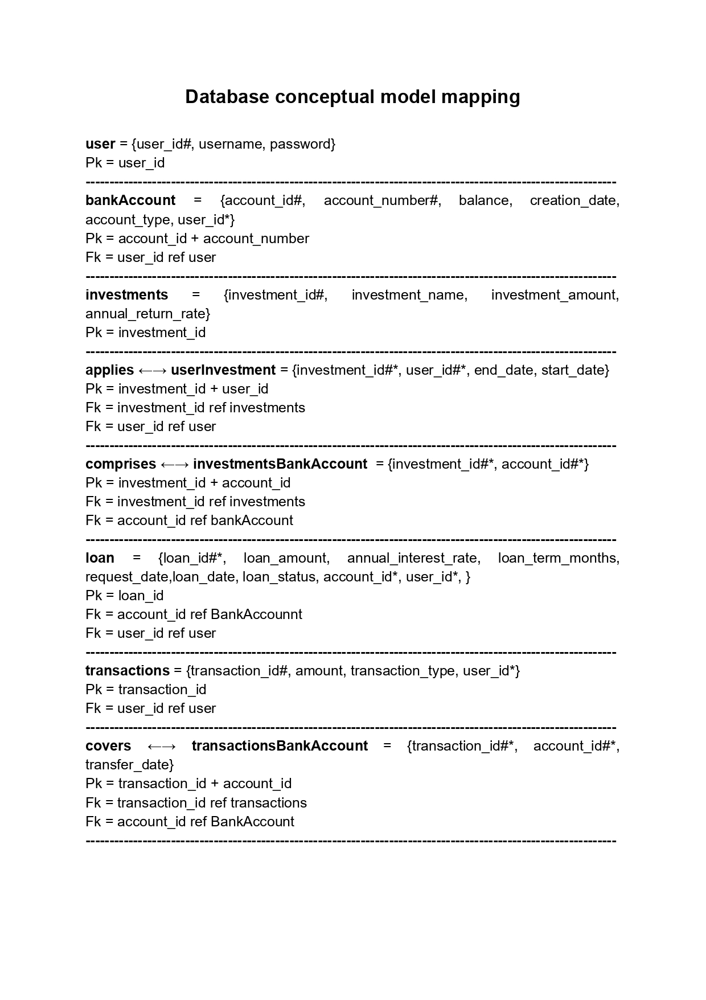

# banking-app

<h1>This banking application goes beyond CRUD operations and basic functionalities. It offers investment forecasts, interest calculation for loans and much more.</h1>
 
<h2>Functional requirements:</h2>
<ul>
  <li>F.R 01: User Authentication</li>
  <li>F.R 02: Bank Account Management</li>
  <li>F.R 03: Banking Operations</li>
  <li>F.R 04: Investment Forecasts</li>
  <li>F.R 05: Interest Loan Calculations</li>
  <li>F.R 06: Balance Inquiries</li>
  <li>F.R 07: Financial Reports</li>
</ul>
 
<h2>Database conceptual modeling:</h2>

 
<h2>Conceptual model mapping:</h2>
