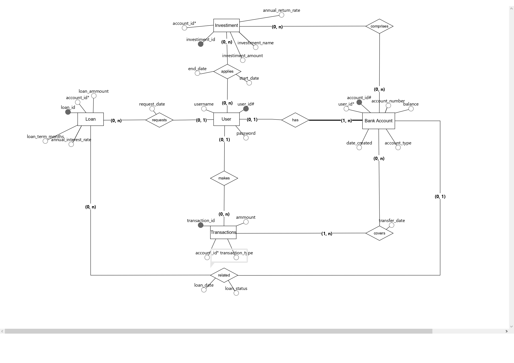
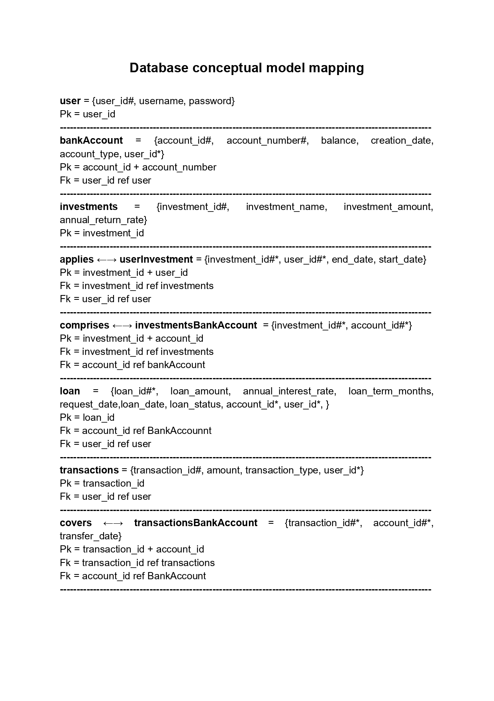

# banking-app

<h1>This banking application goes beyond CRUD operations and basic functionalities. It offers investment forecasts, interest calculation for loans and much more.</h1>
 
<h2>Functional requirements</h2>
<ul>
  <li>F.R 01: User Authentication</li>
  <li>F.R 02: Bank Account Management</li>
  <li>F.R 03: Banking Operations</li>
  <li>F.R 04: Investment Forecasts</li>
  <li>F.R 05: Interest Loan Calculations</li>
  <li>F.R 06: Balance Inquiries</li>
  <li>F.R 07: Financial Reports</li>
</ul>
 
<h2>Database conceptual modeling</h2>

 
<h2>Conceptual model mapping</h2>

 

<h2>Funcionalities</h2>
<h3>User Operations</h3>
<ul>
    <li> <strong>  .createUser(User user) - creates an user</strong></li>
    <li> <strong>.deleteUser(int userId) - deletes an user</strong></li>
    <li><strong> .getUserId(String email) -  returns the email of the specified user</strong></li>
    <li> <strong>  .getUserById(int userId) - returns the user with the specified ID</strong></li>
    <li><strong>  .editUserPassword(int userId, String userNewPassword) - edits the user's password</strong></li>
    <li><strong>.editUserUsername(int userId, String usersNewUsername) - edits the user's username</strong></li>
    <li><strong>.verifyUserEmail(String userEmail) - returns boolean expression</strong></li>
    <li><strong>.verifyUserPassword(String userPassword) - returns boolean expression</strong></li>
    <li><strong>.getUsers() - gets all users</strong></li>
    <li><strong>.showUsers() - to visualize the return of getUsers in the prompt</strong></li>
    <li><strong>.verifyUserId(int userId) - returns boolean expression</strong></li>
</ul>
<h3>Bank Account Operations</h3>
<ul>
    <li><strong>.createBankAccount(BankAccount bankAccount, String email, int userId) - creates a bank account</strong></li>
    <li><strong>.deleteAccount(int bankAccountId) - deletes an account</strong></li>
    <li><strong>.getBankAccounts() - gets all bank accounts</strong></li>
    <li><strong>.showBankAccounts() - shows all bank accounts in the prompt</strong></li>
    <li><strong>getAccountById(int bankAccountId) - gets an account given an Id</strong></li>
    <li><strong>.getBalanceById(int bankAccountId) - gets the account balance</strong></li>
    <li><strong>.updateBalance(float amount,int userId) - updates the balance value of an account</strong></li>
</ul>
<h3>Transaction Operations</h3>
<ul>
    <li><strong>.createTransaction(Transaction transaction, int userId) - creates a transaction</strong></li>
    <li><strong>.getTransactionByUserId(int userId) - gets a transaction given a user Id</strong></li>
    <li><strong>.getTransactionsByType(TransactionType transactionType) - gets a list of transactions given a transaction type</strong></li>
</ul>
<h3>Loan Operations</h3>
<ul>
    <li><strong>.createLoan(Loan loan, int accountId, intuserId) -  creates a loan</strong></li>
    <li><strong>.deleteLoan(int loanId) - deletes a loan given the id of the loan</strong></li>
    <li><strong>.updateLoanStatus(int loanId, LoanStatusType newStatus) - updates the status of a loan</strong></li>
    <li><strong>.getLoanById(int loanId) - gets a loan given a loanId</strong></li>
    <li><strong>.getLoansByUser(int userId) - gets all the loans an user has</strong></li>
    <li><strong>.getLoansByAccountId(int accountId) - gets all the loans given an account Id</strong></li>
    <li><strong>.calculateMonthlyPaymentForLoan(int loanId) - calculates how much you have to pay per month</strong></li>
    <li><strong>.calculateMonthlyPayment(float loanAmount, float annualInterestRate, int loanTermMonths) - calculates the monthly payment</strong></li>
    <li><strong>.getLoanStatus(LoanStatusType loanStatus) - gets all the loans with the given status</strong></li>
</ul>
<h3>Investment Operations</h3>
<ul>
    <li><strong>.createInvestment(Investment investment) - creates an investment</strong></li>
    <li><strong>.deleteInvestment(int investmentId) - deletes an investment with the given Id</strong></li>
    <li><strong>.updateInvestment(int investmentId, String investmentsColumn, String updateContent) - updates an investment with the given parameters</strong></li>
    <li><strong>.listInvestments() - returns a list with all the existing investments</strong></li>
    <li><strong>.getInvestmentById(int investmentId) - returns an investments with the given Id</strong></li>

</ul>